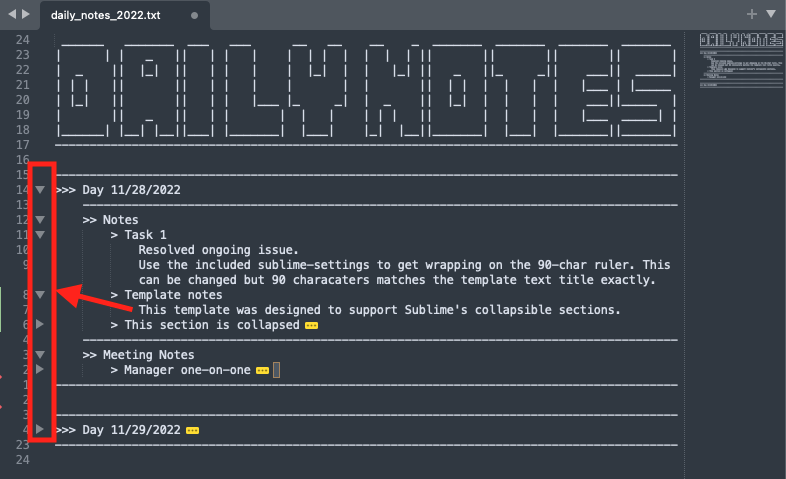

# dailynotes
Script that works with Sublime (on Mac) to help with daily note-taking.



## Add to bin local bin directory using Deploy Script
Update path in .zshenv or .bashrc to include a local bin directory
```
export PATH=$HOME/.local/bin:$PATH
```
Run Deploy script (it will move the file into above location and make it executable)
```bash
./deploy
```

Once complete, you can start taking notes by opening the terminal and typing
```
dailynotes
```
